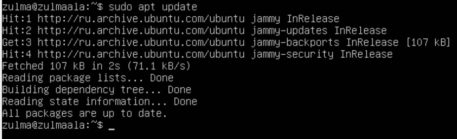
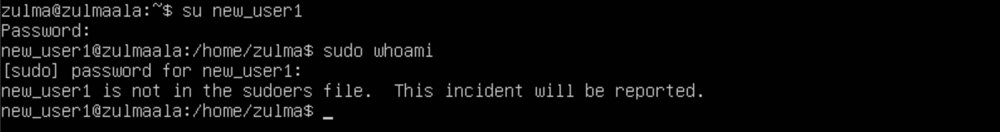
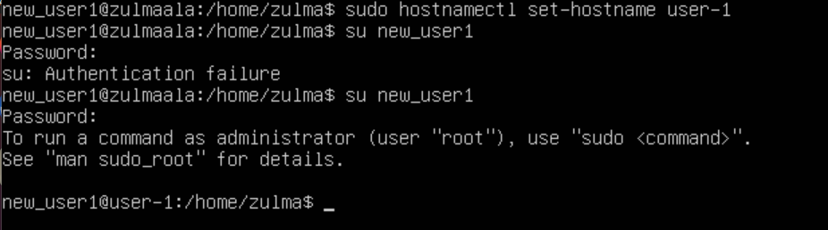

## Part 2. Creating a user
- Creating new user in adm group:
- Command used: sudo adduser -G adm -s /bin/bash -p 1 newuser

-add newuser
- G add new user to particular group
- p set a password
* s set user's login shell
- Check group affiliation

- cat/etc/passwd

## Part 4. OS Update

## Part5. Using the sudo command

- Sudo stands for either "substitute user do"or"super user do" and allows it to temporarily elevate your current user account to have root privleges
- su newuser - switch to new-user from Part2.

- su zulma - switch back to root account

- sudo usermod -aG sudo new_user1 : add sudo rights to new_user1
- sudo hostnamectl set-hostname user-1 then su new_user1 and enter the passwd.
