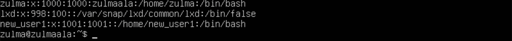
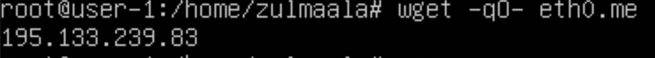
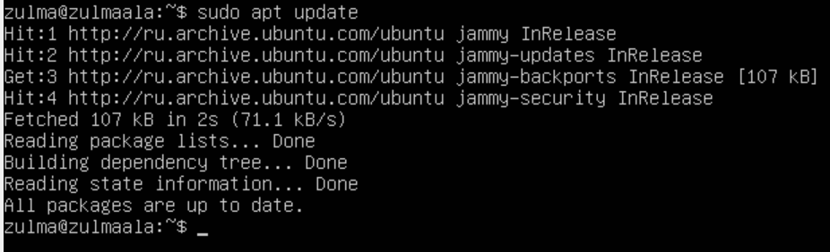
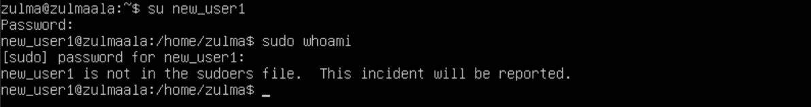
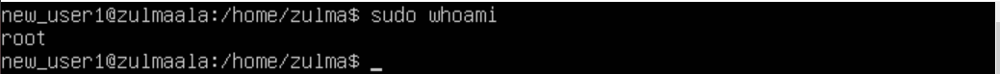
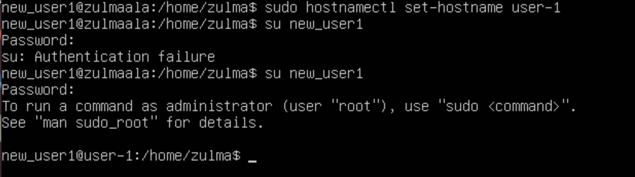
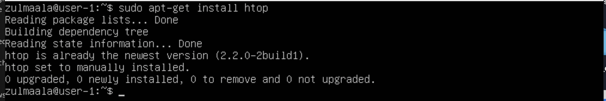

## Part 1. Installation of the OS

- Install Ubuntu 20.04 Server LTS without GUI. (Use VirtualBox).

## Part 2. Creating a user
- Creating new user in adm group:
- Command used: sudo adduser -G adm -s /bin/bash -p 1 new_user1

-add newuser
- G add new user to particular group
- p set a password
* s set user's login shell
- Check group affiliation

- cat/etc/passwd

## Part 3. Setting up the OS network

1. Set the machine name as user-1: Look up the hostname with hostnamectl: $ hostnamectl And edit it using: $ hostnamectl set-hostname 'user-1'

- Result of the hostname look up and hostname change

2. Set the time zone corresponding to your current location: View all available timezones using $ timedatectl list-timezones Set the timezone using $ timedatectl set-timezone Europe/Moscow

- Result of the timezone change

3. Output the names of the network interfaces using a console command: To show all available interfaces I need to use $ ip a

-Show all network interfaces

lo – Loopback interface. The loopback network interface is a virtual network device implemented entirely in software. All traffic sent to it "loops back" and just targets services on your local machine. It represents the Linux-host itself.

4. Use the console command to get the ip address of the device you are working on from the DHCP server: To get the IP-address call the command $ ip --color r or $ ip address (since I got the IP using DHCP either way)

- The IP is 10.0.2.15

DHCP - Dynamic Host Configuration Protocol.

5. Define and display the external ip address of the gateway (ip) and the internal IP address of the gateway, aka default ip address (gw):
To find and display the internal IP of the gateway (default IP) use the following command: $ ip a

- Internal IP address of the gateway

To find the external IP address I need to parse IP-address from a webpage. Wget command can be used for that with flags q and O: $ wget -qO- eth0.me

To find the external IP address I need to parse IP-address from a webpage. Wget command can be used for that with flags q and O: $ wget -qO- eth0.me

- External IP address of the gateway

6. Set static (manually set, not received from DHCP server) ip, gw, dns settings (use public DNS servers, e.g. 1.1.1.1 or 8.8.8.8):
Open the interfaces file with a text editor and admin rights: $ sudo nano /etc/network/interfaces

- Open interfaces to edit

- Enter new values: enter new IP, gateway, mask, dns

- Entered the new dns servers

- Restart the virtual machine using $ sudo reboot: restarted the network
Ping

## Part 4. OS Update

## Part5. Using the sudo command

- Sudo stands for either "substitute user do"or"super user do" and allows it to temporarily elevate your current user account to have root privleges
- su newuser - switch to new-user from Part2.

- su zulma - switch back to root account

- sudo usermod -aG sudo new_user1 : add sudo rights to new_user1
- sudo hostnamectl set-hostname user-1 then su new_user1 and enter the passwd.

## Part 6. Installing and configuring the time service

- Install and set up Chrony to synchronize time:
Synchronized using Chrony

## Part 7. Installing and using text editors

- To exit with the changes saved: ESC, :wq test_vim and tap ENTER

- To exit with the changes saved: control + x , y test_nano tap ENTER

- To exit with the changes saved: control + k, q, y, test_joe

- To exit without saving changes: ESC, :q!, ENTER

- To exit without saving changes: control + x, n

- To exit without saving changes: control + k, q, n

- Replacing using vim:
Command to find and substitute: :s/\<zulmaala\>/21 School 21/ and :q! to exit without saving the changes.

- Replacing using nano:
Command to find and substitute: Control + \, search words you want to replace by taping them + Enter + tape the words you want to insert + Enter + A(Replace all). ^X, n to save the repacement.

- Replacing using joe:
^K + F tap the words you want to replace + Enter + R then tap the word you want to insert.
and tap y. ^Kqn to quit without saving.

## Part 8. Installing and using text editors
- Installed and enabled the SSHd service

- Edit the file: $ sudo vim /etc/ssh/sshd_config

- Show the presence of the sshd process using the ps aux | grep ssh. To do this, you need to match the keys to the command.

- ps is used to get the more and detailed information about a specific process or all processes.
- a- This option prints the running processes from all users.

- u - This option shows user or owner column in output.

- x - This option prints the processes those have not been executed from the terminal.

- Collectively the options "aux" print all the running process in system regardless from where they have been executed.

- Reboot the system: $ sudo reboot

- Explain the meaning of the -tan keys, the value of each output column, the value 0.0.0.0. in the report:

-a - Displays all active connections and the TCP and UDP ports on which the computer is listening.

-n - Displays active TCP connections, however, addresses and port numbers are expressed numerically and no attempt is made to determine names.

-t - Displays only TCP connections.

Proto - The protocol of the connection.

Recv-Q - The data which has not yet been pulled from the socket buffer by the application. High Recv-Q means the data is put on TCP/IP receive buffer, but the application does not call recv() to copy it from TCP/IP buffer to the application buffer.

Send-Q - The data which the sending application has given to the transport, but has yet to be acknowledged by the receiving TCP. High Send-Q means the data is put on TCP/IP send buffer, but it is not sent or it is sent but not acknowledged. So, high value in Send-Q can be related to server network congest, server performance issue or data packet flow control.

Local Address – The IP address of the local computer and the port number being used.

Foreign Address – The IP address and port number of the remote computer to which the socket is connected.

State – Indicates the state of a TCP connection. The possible states are as follows: CLOSE_WAIT, CLOSED, ESTABLISHED, FIN_WAIT_1, FIN_WAIT_2, LAST_ACK, LISTEN, SYN_RECEIVED, SYN_SEND, and TIME_WAIT.

0.0.0.0 - The client devices like PCs show 0.0.0.0 address when they aren’t connected to any TCP/IP network. A device may get this address by default if it’s offline. In the case of address assignment failures, it may be automatically assigned by DHCP. Just in case your device is set to this address, it can’t talk to any other devices on the network over IP.

## Part 9. Installing and using the top, htop utilities:
- Install and run the top and htop utilities:

From the output of the top command we determine and write in the report:
- uptime
- number of authorised users
- total system load
- total number of processes
- cpu load
- memory load

- pid of the process with the highest memory usage

- pid of the process taking the most CPU time

- sorted by PID

- sorted by PERCENT_CPU

- sorted by PERCENT_MEM

- sorted by TIME

- filtered for sshd process
![text](./../img/P9_5_4_sshd.png

- with the syslog process found by searching

- with hostname, clock and uptime output added

## Part 10. Using the fdisk utility

- List all devices: $ sudo fdisk -l /dev/sda
Go over each device to see extended info: $ sudo fdisk -l /dev/sda[number of the disk]

- Names of the disks, capacity and number of sectors:

- Write the swap size: Check the swap size: $ free -h

## Part 11. Using the df utility

- $ df /root Partition size, space used, space free, percentage used for the root partition:

The measurement unit is 1k-blocks - 1024 bytes.

- $ df -Th Partition size, space used, space free, percentage used for the root partition:

## Part 12. Using the du utility

- The size of the /home in bytes and human readable format:

- The size of the /var in bytes and human readable format:

- The size of the /var/log in bytes and human readable format:

- The size of all contents in /var/log:

- $ sudo du /var/log -a | less:

- $ sudo du /var/log -ah | less:

## Part 13. Installing and using the ncdu utility
sudo apt install ncdu
- The size of the ncdu /home:

- The size of the ncdu /var:

- The size of the ncdu /var/log:

## Part 14. Working with system logs

- /var/log/dmesg – Contains kernel ring buffer information. When the system boots up, it prints number of messages on the screen that displays information about the hardware devices that the kernel detects during boot process.

- var/log/syslog - Logs everything, except auth related messages.

- var/log/auth.log - Contains system authorization information, including user logins and authentication machinsm that were used.

Open for viewing:

`vim /var/log/dmesg`

`vim /var/log/syslog`

`cat /var/log/auth.log | grep systemd-logind` - the last successful login time

`sudo systemctl restart ssh.service`
`vim /var/log/syslog`
)

<!-- -dmesg is a command to read the contents from /var/log/dmesg. The nice thing compared to less /var/log/dmesg is that I can use the -T flag for human readable time output. -->

## Part 15. Using the CRON job scheduler

- Using the job scheduler, run the uptime command in every 2 minutes:

$ crontab -e and select the text editor - To edit the configuration file.
$ */2 * * * * uptime - New task added.
Lines in the system logs (at least two within a given time range) about the execution:

- Display a list of current jobs for CRON $ crontab -l:

- Command 'Uptime' is launched every two minutes, grep -i cron /var/log/syslog:

- Remove all tasks from the job scheduler:

$ crontab -r - remove all tasks;
<!-- $ crontab -l - list all tasks; -->
The list of current tasks for CRON:

